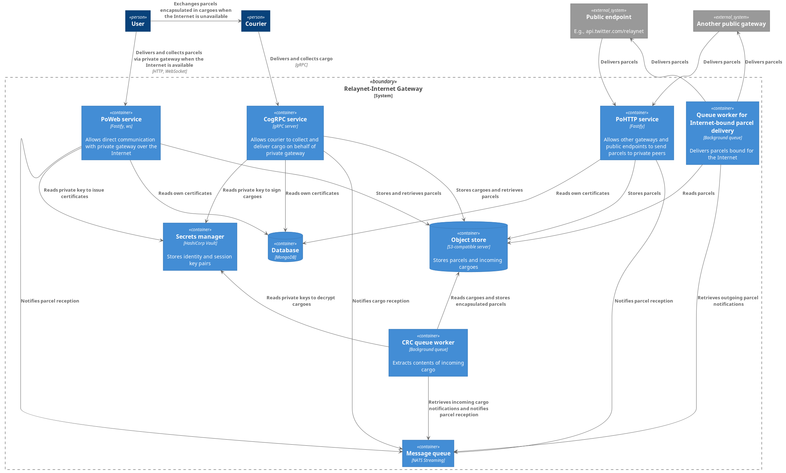

# Architecture

The overall system comprises a series of services, background queues and third-party [backing services](https://12factor.net/backing-services), as shown in the diagram below:

All the services and background queues provided by this Internet gateway run on Node.js and share a common Docker image.

## Services

This app implements the minimum set of services required for a Relaynet Internet gateway:

### PoWeb server

A [PoWeb](https://specs.relaynet.network/RS-016) server, to exchange parcels with private gateways via the Internet.

This server is powered by [Fastify](https://www.fastify.io/) and [`ws`](https://www.npmjs.com/package/ws).

### CogRPC server

A [CogRPC](https://specs.relaynet.network/RS-008) server, to exchange parcels with private gateways via an end-to-end encrypted sneakernet.

An operator may choose not to deploy the CogRPC server if their users don't need the ability to use the sneakernet.

This server is powered by [`grpc`](https://www.npmjs.com/package/grpc).

### PoHTTP server

A [PoHTTP](https://specs.relaynet.network/RS-007) server, to receive parcels from other gateways or public endpoints.

This server is powered by [Fastify](https://www.fastify.io/).

## Background queues

For performance, scalability and reliability reasons, the services above defer computationally- or IO-intensive operations to background queues:

### Cargo Relay Connection (CRC) queue

The CRC queue decrypts and processes the contents of each cargo stored by the CogRPC service.

### Parcel Delivery Connection (PDC), Internet-bound queue

This queue delivers each parcel stored by the CogRPC and PoWeb services. This client uses [@relaycorp/relaynet-pohttp](https://www.npmjs.com/package/@relaycorp/relaynet-pohttp).

## Backing services

The components provided by this Internet gateway employ the following third-party backing services:

### S3-compatible, object store server

This server is used to store parcels bound for private gateways. [Minio](https://min.io/) is used in development.

### CloudEvents broker

Any [CloudEvents](https://cloudevents.io) supported by [`@relaycorp/cloudevents-transport`](https://www.npmjs.com/package/@relaycorp/cloudevents-transport).

### Redis

[Redis PubSub](https://redis.io/docs/interact/pubsub/) is used for inter-component communication using asynchronous messaging, when we don't need messages to be persisted. The following channels are used:

- `pdc-parcel.${privateGatewayId}` where `${privateGatewayId}` is the id of the private gateway. Parcels received via Internet-based PDCs (e.g., PoHTTP) are published on these channels.

### Key Management Service (KMS)

Any KMS supported by [`@relaycorp/webcrypto-kms` documentation](https://www.npmjs.com/package/@relaycorp/webcrypto-kms).

### MongoDB

[MongoDB](https://www.mongodb.com/) is used to store the certificates owned by the Internet gateway instance, as well as transient metadata about private gateways (e.g., DH public keys, outgoing parcels).
