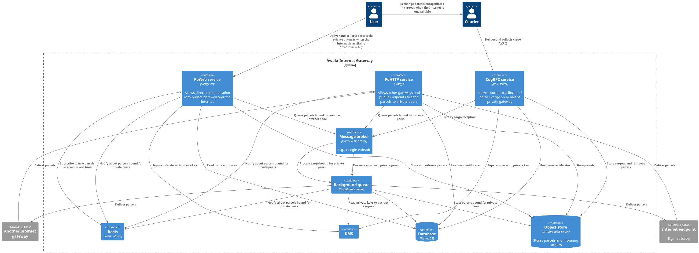

# Architecture

The overall system comprises a series of services, background queues and third-party [backing services](https://12factor.net/backing-services), as shown in the diagram below:

All the services and background queues provided by this public gateway run on Node.js and share a common Docker image.

## Services

This app implements the minimum set of services required for a Relaynet public gateway:

### PoWeb server

A [PoWeb](https://specs.relaynet.network/RS-016) server, to exchange parcels with private gateways via the Internet.

This server is powered by [Fastify](https://www.fastify.io/) and [`ws`](https://www.npmjs.com/package/ws).

### CogRPC server

A [CogRPC](https://specs.relaynet.network/RS-008) server, to exchange parcels with private gateways via an end-to-end encrypted sneakernet.

An operator may choose not to deploy the CogRPC server if their users don't need the ability to use the sneakernet.

This server is powered by [`grpc`](https://www.npmjs.com/package/grpc).

### PoHTTP server

A [PoHTTP](https://specs.relaynet.network/RS-007) server, to receive parcels from other gateways or public endpoints.

This server is powered by [Fastify](https://www.fastify.io/).

## Background queues

For performance, scalability and reliability reasons, the services above defer computationally- or IO-intensive operations to background queues:

### Cargo Relay Connection (CRC) queue

The CRC queue decrypts and processes the contents of each cargo stored by the CogRPC service.

### Parcel Delivery Connection (PDC), Internet-bound queue

This queue delivers each parcel stored by the CogRPC and PoWeb services. This client uses [@relaycorp/relaynet-pohttp](https://www.npmjs.com/package/@relaycorp/relaynet-pohttp).

## Backing services

The components provided by this public gateway employ the following third-party backing services:

### S3-compatible, object store server

This server is used to store parcels and cargoes under the following object key prefixes:

- `parcels/endpoint-bound/` for public endpoint-bound parcels. Those parcels won't stay long there because they'll either be delivered quickly or we may give up after trying for up to 24 hours. Consequently, objects in here can be automatically deleted after 24 hours.
- `parcels/gateway-bound/` for private gateway-bound parcels. It may take up to 6 months for a parcel to be collected according to the Relaynet specs, so objects here can be automatically deleted after that time.
- `cargoes/pending-unwrapping/` for cargoes received via the CogRPC server.

[Minio](https://min.io/) is used in development.

### NATS Streaming

[NAT Streaming](https://docs.nats.io/nats-streaming-concepts/intro) is used for inter-component communication using asynchronous messaging. The following channels are used:

- `pdc-parcel.${privateGatewayId}` where `${privateGatewayId}` is the id of the private gateway. Parcels received via Internet-based PDCs (e.g., PoHTTP) are published on these channels.
- `internet-parcels`. Parcels bound for an internet.
- `crc-cargo`. Cargo received via CRC (e.g., CogRPC) are published here.

### HashiCorp Vault

[HashiCorp Vault](https://www.vaultproject.io/) is used to store the key pairs for identity and session keys.

### MongoDB

[MongoDB](https://www.mongodb.com/) is used to store the certificates owned by the public gateway instance, as well as transient metadata about private gateways (e.g., DH public keys, outgoing parcels).
